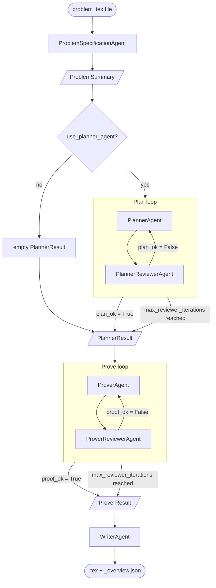

# pde-agent-framework

**pde-agent-framework** is a multi-agent LLM pipeline that turns a formal mathematical
problem statement into a rigorous, LaTeX-typeset proof — orchestrating specialized
agents that extract the problem, plan a proof strategy, write the proof, and critically
review each step against the stated assumptions. Beyond just generating proofs, the
framework was designed from the ground up to make its own cost and convergence behavior
measurable, enabling direct, apples-to-apples comparisons across models and pipeline
configurations (see [Model Comparison](#model-comparison)).

## Table of Contents

- [Pipeline Overview](#pipeline-overview)
- [Project Structure](#project-structure)
- [Installation](#installation)
- [Tests](#tests)
- [Running the Experiments](#running-the-experiments)
- [Model Comparison](#model-comparison)
  - [Problem Independent Results](#problem-independent-results)
  - [Cea's Lemma Deep Dive](#ceas-lemma-deep-dive)
- [Future Work](#future-work)
- [License](#license)

## Pipeline Overview

The framework turns a mathematical problem statement (a `.tex` file) into a finished
LaTeX proof through four stages: an agent first **extracts** the task, objects,
assumptions, and allowed tools into a structured `ProblemSummary`; a `PlannerAgent` then
optionally **plans** a proof outline, refining it against a `PlannerReviewerAgent`'s
feedback until the plan is approved or the iteration budget runs out; a `ProverAgent`
**proves** the theorem from that plan (or from the problem alone, if planning was
skipped), again refined against a `ProverReviewerAgent`; and finally a `WriterAgent`
**writes** the accepted proof as compilable LaTeX, alongside a JSON overview of the run
(iteration counts, token usage, model used).



Both review loops are the same `agent_reviewer_loop` function, parameterized by
`loop_name`; they stop early on approval or once `max_reviewer_iterations` is reached.

## Project Structure

```
src/pde_agent_framework/
├── agent_systems/   # Agent definitions: ProblemSpecificationAgent, PlannerAgent,
│                    # PlannerReviewerAgent, ProverAgent, ProverReviewerAgent, WriterAgent
├── schemas/         # Pydantic I/O contracts between pipeline stages (ProblemSummary,
│                    # PlannerResult, ProverResult, ExperimentConfig, ExperimentOverview, ...)
├── tools/
│   ├── agent_tools/ # @function_tool functions exposed to agents (e.g. load_problem_file)
│   └── utils/       # Orchestration logic: agent_reviewer_loop, run_proof_pipeline
└── experiments/     # CLI entrypoint: run_experiment.py

problems/            # Problem statements (.tex) to feed into the pipeline
results/             # Generated proofs and run overviews (not tracked in git)
tests/               # pytest suite
```

## Installation

**Option A: Dev Container**

The repo ships a [`.devcontainer`](.devcontainer/devcontainer.json) config built on the
provided [`Dockerfile`](Dockerfile) (Python 3.13, with `requirements.txt` installed at
image build time). With Docker and the VS Code "Dev Containers" extension installed,
open the repo in VS Code and choose "Reopen in Container" — the image is built and every
dependency is ready, no local Python setup needed.

**Option B: Bare metal**

Install directly on your own machine (Python 3.13+ required):

```bash
python3 -m venv .venv
source .venv/bin/activate
pip install -r requirements.txt
```

## Tests

Either way, verify the installation with the test suite:

```bash
pytest tests/
```

`pyproject.toml` already points pytest at `src/`, so no `PYTHONPATH` is needed here —
unlike running the experiment script directly, see below.

## Running the Experiments

**Prerequisites**
- An OpenAI API key with access to whichever model you want to use

**Setup**
1. Copy `.env.example` to `.env`.
2. Fill in `OPENAI_API_KEY` and set `MODEL_NAME` to the model you want to run against.

**Run**

`src/pde_agent_framework/experiments/run_experiment.py` runs a single Extract -> maybe
Plan -> Prove -> Write pass over one problem file and writes the results (`.tex` +
`_overview.json`) to the given output directory. Pass `--planner` to employ the
PlannerAgent-PlannerReviewerAgent loop; omit it to skip straight to proving. From the
repo root:

```bash
# with the planner-reviewer loop
PYTHONPATH=src python3 -m pde_agent_framework.experiments.run_experiment \
    problems/Parabolic_Estimator/parabolic_estimator.tex results/Parabolic_Estimator/ --planner

# without it
PYTHONPATH=src python3 -m pde_agent_framework.experiments.run_experiment \
    problems/Parabolic_Estimator/parabolic_estimator.tex results/Parabolic_Estimator/
```

Run it twice (with and without `--planner`) to reproduce the side-by-side comparison
below. To try a different problem, just add a `.tex` file describing it under
`problems/` and point the command at it — no code changes needed.

## Model Comparison

`ExperimentConfig` and `ExperimentOverview` were designed from the start to make reviewer
convergence (iterations per review loop) and cost (input/output tokens) first-class,
measurable outputs of every run, rather than something only visible by reading logs.
That made it possible to run a direct, apples-to-apples comparison across models and
pipeline configurations, instead of a one-off "it worked" demonstration.

Both experiments (Cea's Lemma Proof, Parabolic Estimator) were run with two models,
gpt-6-sol and gpt-5.4-nano, each with and without the PlannerAgent-PlannerReviewerAgent
loop enabled, to compare cost and convergence behavior. All runs carried out so far;
"Result" is the timestamp identifying the corresponding files under
`results/<Problem>/` (e.g. `<timestamp>.tex`, `<timestamp>_overview.json`):

| Problem | Model | Planner | Planner iters | Prover iters | Input / Output tokens | Proof correct? | Result | Notes |
|---|---|---|---|---|---|---|---|---|
| Cea's Lemma | gpt-6-sol | yes | 2 | 1 | 16,072 / 5,021 | yes | 20260925_094812 | before the coercivity-assumption typo was fixed |
| Cea's Lemma | gpt-6-sol | no | — | 1 | 7,377 / 3,061 | yes | 20260925_094853 | before the coercivity-assumption typo was fixed |
| Cea's Lemma | gpt-6-sol | yes | 1 | 1 | 11,920 / 3,415 | yes | 20260925_101906 | |
| Cea's Lemma | gpt-6-sol | no | — | 1 | 7,539 / 3,085 | yes | 20260925_101943 | |
| Cea's Lemma | gpt-5.4-nano | yes | 5 (capped) | 1 | 35,231 / 9,291 | yes | 20260926_105435 | |
| Cea's Lemma | gpt-5.4-nano | no | — | 5 (capped) | 30,941 / 9,042 | yes (with reservations) | 20260926_105535 | |
| Parabolic Estimator | gpt-6-sol | yes | 1 | 1 | 35,268 / 11,972 | yes | 20260925_102535 | |
| Parabolic Estimator | gpt-6-sol | no | — | 1 | 21,625 / 11,591 | TBD | 20260925_102759 | |
| Parabolic Estimator | gpt-6-sol | yes | 1 | 1 | 35,932 / 14,424 | TBD | 20260926_102503 | repeat run |
| Parabolic Estimator | gpt-6-sol | no | — | 2 | 36,347 / 15,360 | TBD | 20260926_102724 | repeat run |
| Parabolic Estimator | gpt-5.4-nano | yes | 5 (capped) | 5 (capped) | 128,593 / 38,246 | TBD | 20260926_104338 | |
| Parabolic Estimator | gpt-5.4-nano | no | — | 5 (capped) | 58,788 / 22,120 | TBD | 20260926_104551 | |

"Proof correct?" reflects a manual mathematical review of each generated proof against
the stated theorem, not an automated check — pending review.

### Problem Independent Results 

gpt-6-sol consistently converges (its own reviewer approves the plan/proof) within 1-2
iterations. **gpt-5.4-nano, in contrast, exhausts the `max_reviewer_iterations` cap in
almost every run** — its own reviewer essentially never approves a plan or proof within
the allotted budget.

As a direct consequence, **gpt-5.4-nano's token usage is significantly larger than
gpt-6-sol's**, since each additional iteration resends the accumulated feedback history;
on the harder Parabolic Estimator problem this reaches roughly 3-4x more tokens. Hence,
one cannot expect to save money by employing a cheaper, older model: if it fails to
converge within the review budget, the resulting iteration overhead can make it more
expensive overall than a stronger, pricier model that gets it right on the first or
second try.

### Cea's Lemma Deep Dive

Analyzing the Cea's Lemma experiments, we see that all generated proofs were correct. However, in the `20260926_105535` experiment, there is one
little inaccuracy. Therein, the following is written: "fix a finite-dimensional subspace". However, `ceas_lemma_proof.tex` defines explicitly
a concrete finite dimensional subspace of the Sobolev space.

The experiments in the first two rows were conducted with a typo in the
`ceas_lemma_proof.tex` concerning the coercivity condition. To be precise, the coercivity condition
for the first two experiments were defined as
```math
\begin{gather*}
     a\left(u, v\right) \geq c \left\| u \right\|_{1,\Omega}^2 \quad \text{for all } u,v \in H^1_0(\Omega).
\end{gather*}
```
This is, of course, not correct. The experiment employing the planner agent explicitly points out that the coercivity condition is incorrect.
In the following, the gpt-6-sol assumes that this is only a typo. In the `20260925_094853` experiment, where no planner agent is utilized,
the error is ignored and the correct definition is simply used. However, based on the available experiments on Cea's Lemma,
it is not possible to determine whether the proof was derived classically or whether it was part of the training data and was simply reproduced.
The `20260925_101906` and `20260925_101943` experiments indicate that the proof was part of the training data. Comparing the first
paragraphs of both results, we see that sentences are almost identical.

## Future Work

- Design an implementation pipeline that takes the theoretical results produced by the
  proof pipeline and verifies them numerically on suitable examples.
- Persist the PlannerReviewer/ProverReviewer feedback history to disk, so that
  runs which exhaust max_reviewer_iterations without approval can be debugged after
  the fact instead of only being visible as a raw iteration count.

## License

This project is licensed under the [MIT License](LICENSE).
